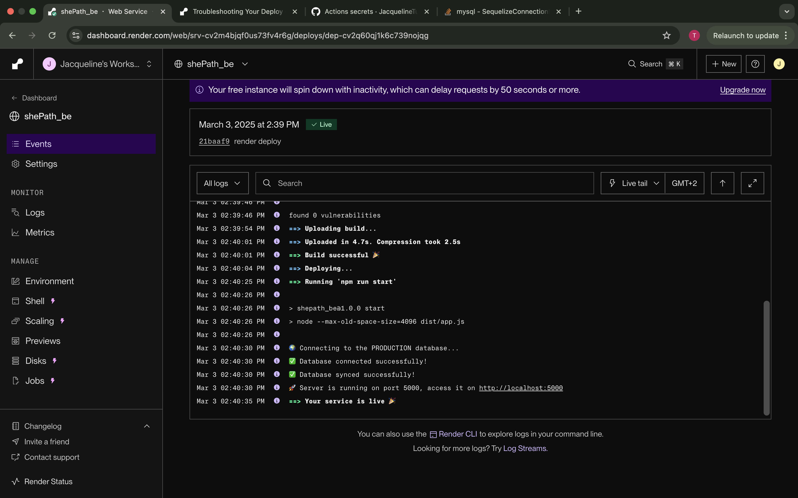

# ShePath

## 📖 Description

The **ShePath Application** is a platform designed to empower women by providing mentorship, resources, and a supportive community. The project includes/will include a **backend API** and a **frontend interface** to ensure smooth and effective functionality.

---

## 🔗 GitHub Repositories
- **Backend Repository**: [ShePath Backend](hhttps://github.com/JacquelineTuyisenge/shePath_be.git)
- **Frontend Repository**: [ShePath Frontend](https://github.com/JacquelineTuyisenge/shePath_fe.git)

---

## 🛠️ How to Set Up the Environment and the Project

### Prerequisites
- Node.js (v16+)
- PostgreSQL (for the database)
- Sequelize (for ORM in the backend)
- React.js (for the frontend)
- Docker (for containerization)

### Backend Setup
1. Clone the backend repository:
   ```bash
   git clone https://github.com/JacquelineTuyisenge/shePath_be.git
   cd shepath-be
   ```

2. Install dependencies:

```bash
npm install
```

Create a .env file in the root directory for env variables

env
DB
PORT
DB_Test
JWT_SECRET

Run database migrations and seeders:


```bash
npm run start
npm run migrate
npm run seed
```

Access Swagger documentation at [COMING SOON!](http://localhost:3000/api-docs.)

### Frontend Setup
Clone the frontend repository:

```bash
git clone https://github.com/JacquelineTuyisenge/shePath_fe.git
cd shepath-fe
```

Install dependencies:


```bash
npm install
```
Create a .env file 

Start the React development server:

```bash
npm run dev
```
Open the app in your browser at :
https://she-path-front.vercel.app


🚀 Deployment Plan

Backend
- Render deployment
- link: 
https://shepath-be.onrender.com/
- screenshot:


Frontend
- Vercel deployment
link: 
she-path-front.vercel.app/
- screenshots:
